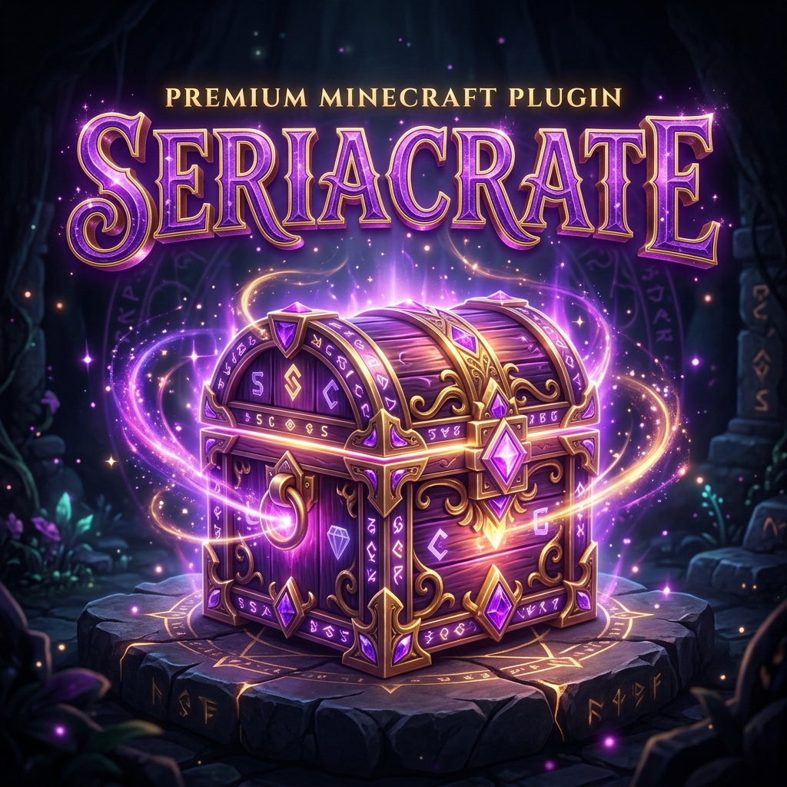

# SeriaCrate

## Overview
**SeriaCrate** is an advanced crate and gacha system featuring a unique "Resin" (Stamina) mechanic. It provides high-quality animations, categorized rewards, and deep integration with the Seria ecosystem.

## Features
- **Gacha Animation**: Smooth, premium UI animations for opening crates.
- **Resin System**: Limit crate openings with a regenerating stamina system, perfect for balanced economy servers.
- **Categorized Rewards**: Organize rewards into tiers with custom weights and chances.
- **MMOItems & EcoPets Support**: Directly reward players with custom RPG items or pets.
- **Dynamic Configuration**: Hot-reloadable rewards and crate settings.

## Commands
- `/opencrate`: Open the main crate UI.
- `/resin`: Check your current resin amount and regeneration time.
- `/seriacrate` (or `/scrate`): Admin commands for managing crates and players.
- `/resinadmin`: Manage player resin amounts.

## Developer Wiki
For detailed placeholder usage, configuration schemas, and command lists, visit the [Wiki](docs/WIKI.md).
