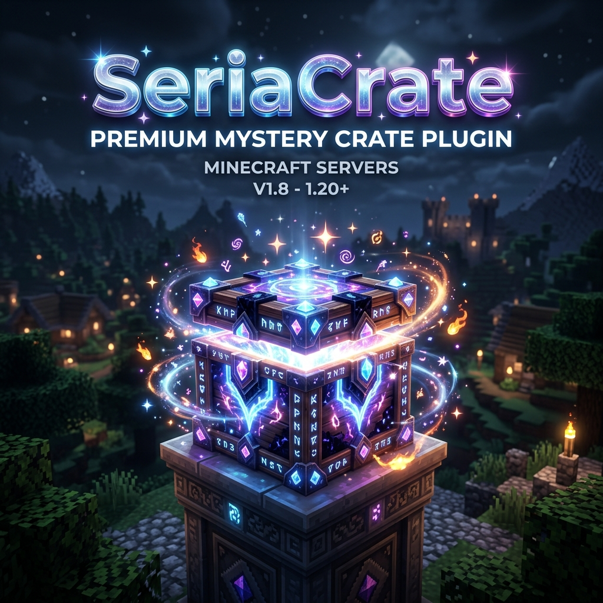

# SeriaCrate 💎



**SeriaCrate** is a high-performance, feature-rich Minecraft crate plugin designed for modern servers. It features smooth animations (Rolling Engine), a unique Resin currency system, and an intuitive in-game editor.

## ✨ Key Features

- **🌀 Advanced Rolling Engine**: Multiple animation styles for opening crates, including horizontal and vertical scrolls.
- **💎 Resin Currency System**: Integrated economy/item system specifically for interacting with crates.
- **🛠️ In-Game Editor**: Create and manage reward tiers, crates, and prizes directly from a GUI.
- **📦 Dynamic Reward Tiers**: Organize rewards into custom classes with different probabilities.
- **🖼️ Preview System**: Players can preview rewards before opening a crate.
- **🔗 PlaceholderAPI Support**: Effortlessly display player statistics and crate info anywhere.

## 🚀 Getting Started

### Prerequisites

- **Java**: 21 or higher
- **Server**: Paper / Spigot (1.20.x+)
- **Dependencies**: [Auxilor](https://github.com/Auxilor) (eco/libre) and [PlaceholderAPI](https://placeholderapi.com/).

### Installation

1. Download the latest `SeriaCrate-1.1.0.jar`.
2. Drop it into your server's `plugins` folder.
3. Restart your server.
4. Configure your rewards and crates in the `plugins/SeriaCrate/rewards/` folder.

## 📖 Documentation

For detailed information, please refer to our **Wiki**:

*   [System & Rolling Engine](./docs/SYSTEM.md)
*   [Commands & Permissions](./docs/COMMANDS.md)
*   [Configuration Guide](./docs/CONFIG.md)
*   [In-Game Editor Guide](./docs/EDITOR.md)

## 🛠️ Maven Integration

```xml
<dependency>
    <groupId>id.seria</groupId>
    <artifactId>SeriaCrate</artifactId>
    <version>1.1.0</version>
</dependency>
```

---

*Developed with ❤️ by the Seria Team.*
